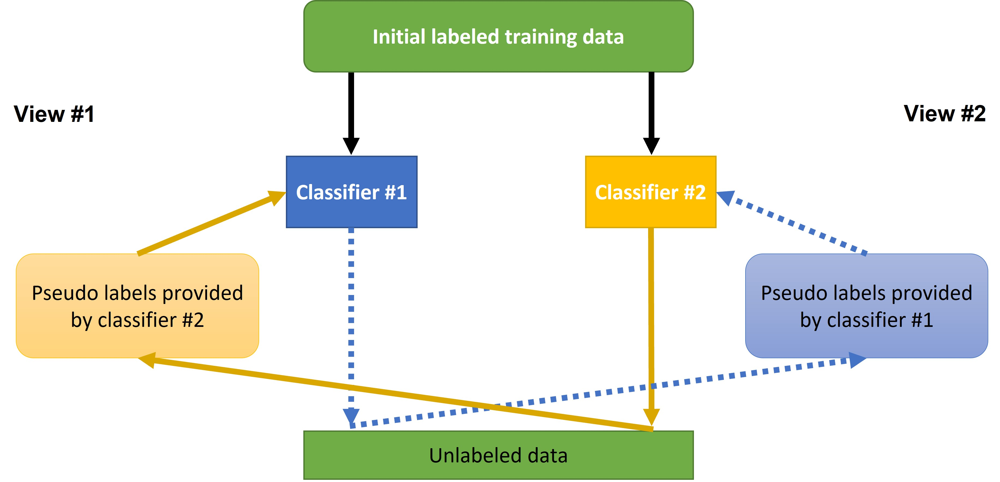
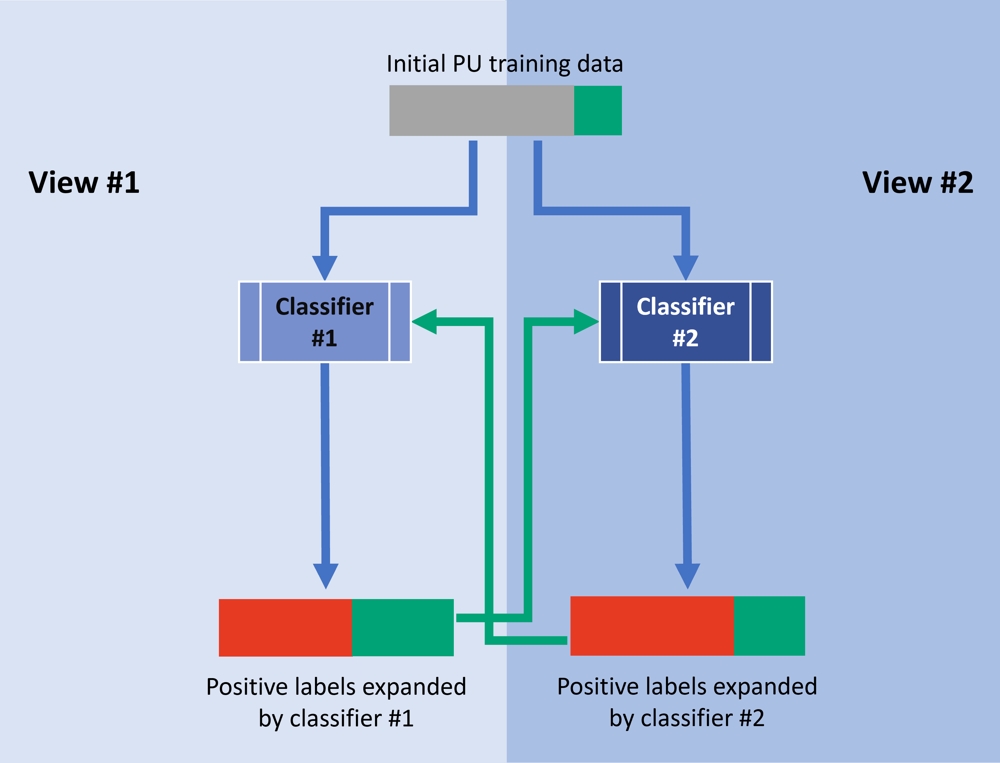

# SynCoTrain 
Co-Training for Crystal Synthesizability Prediction
## Intoroduction
SynthCoTrain is a materials-informatics package which predicts the synthesizability of crystals. The nature of the problem is a semi-supervised classification, in which we access only to positively labeled and unlabeled data points. SynCoTrain does this classification task by combining two semi-supervised classification methods: **Positive and Unlabeled (PU) Learning** and **Co-training**. The classifiers used in this package are the ALIGNN https://github.com/usnistgov/alignn and the SchNetPack https://github.com/atomistic-machine-learning/schnetpack.

<!--  -->
<div style="text-align:center">

</div>

The final model achieves a notable true-positive rate of nearly 95% for the experimentally synthesized test set and predicts that 31% of the theoretical crystals are synthesizable. These results go beyond the scope of thermodynamic stability analysis alone. This work carries significant implications, including the filtration of structural predictions from high-throughput simulations to identify synthesizable candidates.

## Installation
First we need conda environments. This package used two separate models, and each of them rquire their own conda environment. For running the ALIGNN model, create a conda env for ALIGNN and activate the environment:
```bash
conda create -n puAlignn python=3.9
conda activate puAlignn
```
Then, you can install the required packages for ALIGNN from the Inline code `requirements_alignn.txt`.
```bash
pip install -r requirements_alignn.txt
```
If `requirements_alignn.txt` doe not work, you can also try `alignn_pipfreee.txt` instead.
After installing the required packges, you can install SynCoTrain by
```
cd /path/to/SynCoTrain
pip install .
```

Now you have installed ALIGNN and SynCoTrain in your new puAlignn env. Similarly, you can create a separate conda env for the SchNetPack and install the corresponding packages there:
```bash
conda create -n puSchnet python=3.9
conda activate puSchnet
pip install -r requirements_schnet.txt
cd /path/to/SynCoTrain
pip install .
```


## Using the pre-trained model
## Auxiliary exeperiments
This package provides two auxiliary experiments. The first one includes running the regular experiments on only 5% of the available data. This is useful for checking the workflow of the code, without waiting for weeks for the computation to conclude. Please note that quality of results will suffer, as there is less data available for training.
The second auxiliary experiment is consists of classifying the stability of crystals based on their energy above hull, through the same PU Learning and Co-training code. The utility of this experiment is that, unlike a real case of Positive and Unlabeled Learning, we have access to real label of the unlabeled class. As stability is highly related to synthesizability, the quality of this experiment can be used as a proxy to judge the quality of the main experiment. We are mainly interested to see whether the real-true-positive-rate of these experiments are close in value to the true-positive-rate produced by PU Learning.
### Data preparation for auxiliary exeperiments
The data-set needed for both auxilary experiemnts can be produced from the main data. Simple, run the data_scripts/auxiliary_data_015.py file to produce both data-sets:
```
python data_scripts/auxiliary_data.py
```
## Training the models
To replicate the results of this library, you need to run the scripts made for running each PU experiment. There are three experiments for each of the models, with pre-defined data handling. Each experimment consists of 60 iterations of PU learning.

First, the base experiment is run with each model. Next, each model can be trained on the additional psuedo-labels provided by the other model. 

Please note that these experiments are rather long. Using a NVIDIA A100 80GB PCIe GPU, each experiment took an average of one week or more to conclude. So, for the full-data experiment, you may want to use the `nohup` command, as shown later.

It is recommended not to run simultanous experiments on the same gpu, since you run the risk of overflowing the gpu memory and crashing the experiment mid-way.

Before co-training, we need to train our models separately on our PU data; we call this step iteration "0". The code for running the SchNetPack part of this step could be :
```
conda activate puSchnet
python pu_data_selection.py --experiment schnet0
nohup python pu_schnet/schnet_pu_learning.py --experiment schnet0 --gpu_id 0 > nohups/schnet0_synth_gpu0.log &

```
Similarly for the ALIGNN experiment we have:
```
conda activate puAlignn
python pu_data_selection.py --experiment alignn0
nohup python pu_schnet/schnet_pu_learning.py --experiment alignn0 --gpu_id 0 > nohups/alignn0_synth_gpu0.log &

```
After each experiment is concluded, the data needs to be analyzed to produce the relevant labels for the next step of co-training. The code for the analysis of results of SchNetPack is

```
conda activate puSchnet
python pu_schnet/schnet_pu_analysis.py --experiment schnet0 

```
and for ALIGNN:
```
conda activate puAlignn
python pu_alignn/alignn_pu_analysis.py --experiment alignn0 

```
From this point, it matters that the experiments are executed in their proper order. Before each PU experiment, the relevant data selection needs to be performed. After each PU experiment, the analysis of the results are needed to produce the labels for the next iteration. The commands to run these experiments can be found on `synth_commands.txt`.

The correct order of running the experiments starting from alignn0 is:
alignn0 > coSchnet1 > coAlignn2 > coSchnet3
and for the other view, starting from schnet0:
schnet0 > coAlignn1 > coSchnet2 > coAlignn3

## Stability experiments
The auxiliary stability experiments can be run with almost the same commands, except for an extra `--ehull015 True` flag. The relavant commands are stored in `stability_commands.txt`.

## Training the predictor
After the final round of predictions, the predictions are averaged to produce the final labels. Then, the final ALIGNN-based model is trained as follows:
```
conda activate puAlignn
python predict_target/label_by_average.py
nohup python predict_target/train_folder.py > nohups/synth_predictor.log &
```
## Predict Synthesizability
Finally we can predict synthesizability. You can use the checkpoint file `predict_target/synth_final_preds/checkpoint_120.pt` and follow the instructions on ALIGNN repository to use pretrained model.
For a simpler use, you can deposite the POSCAR files of the crystals of your interest in the `predict_target/label_alignn_format/poscars_for_synth_prediction` directory. The command below predicts the synthesizability of these crystals and saves them in `synth_pred.csv` in the same directory:
```
conda activate puAlignn
python predict_target/synthesizability_predictor.py 
```


