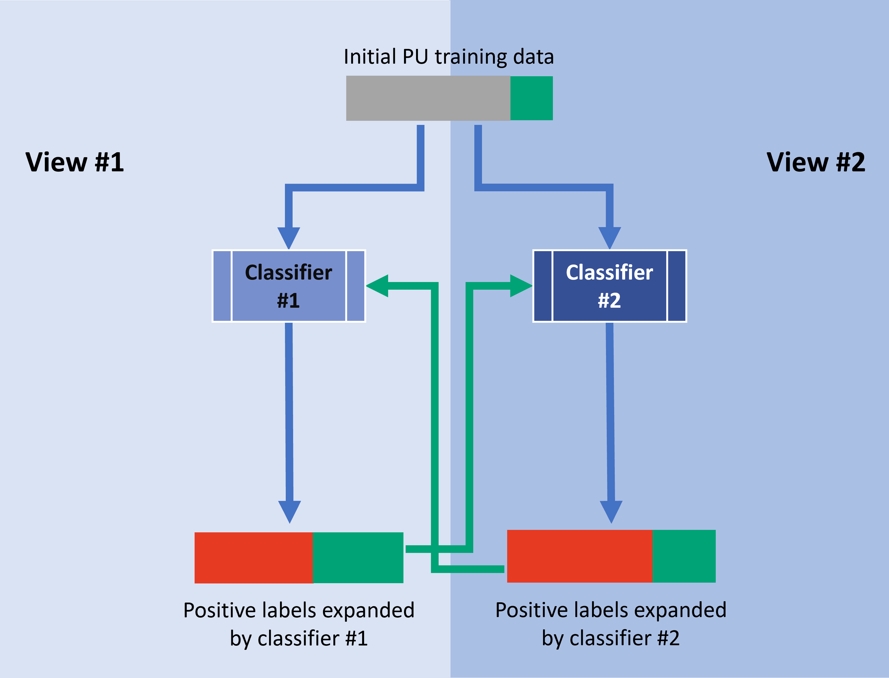

# SynCoTrain 
Co-training enhanced PU-learning for crystal synthesizability prediction.


## Introduction
SynthCoTrain is a materials-informatics package which predicts the synthesizability of crystals. The nature of the problem is a semi-supervised classification, in which we access only to positively labeled and unlabeled data points. SynCoTrain does this classification task by combining two semi-supervised classification methods: **Positive and Unlabeled (PU) Learning** and **Co-training**. The classifiers used in this package are [ALIGNN](https://github.com/usnistgov/alignn) and [SchNetPack](https://github.com/atomistic-machine-learning/schnetpack).

<!--  -->
<div style="text-align:center">

</div>

The final model achieves a notable true-positive rate of 96% for the experimentally synthesized test-set and predicts that 29% of the theoretical crystals are synthesizable. These results go beyond the scope of thermodynamic stability analysis alone. This work carries significant implications, including the filtration of structural predictions from high-throughput simulations to identify synthesizable candidates.


## Installation
It is recommended to create a virtual environment with mamba and miniforge to install the different packages easily. Start by installing mamba according to the instructions [here](https://mamba.readthedocs.io/en/latest/installation/mamba-installation.html).

Start by cloning this repository in your preferred path as shown below:
```bash
cd /path/to/parent/directory
git clone git@github.com:BAMeScience/SynCoTrainMP.git
```
Next, navigate to the cloned directory. You can create the appropriate mamba environment there based on the `sync.yml` file:
```bash
cd SynCoTrain
mamba env create -f condaEnvs/sync.yml
mamba activate sync
```
This might take a while, as all the required packages are being installed. Please note that you may need to change ther exact version of dgl and cudatoolkit based on your current setup. You can check your current cuda version using the `nvidia-smi` command. Then, you can search for a compatible dgl with cuda using the command `mamba search dgl --channel conda-forge`. Pick a version of dgl earlier than 2.0.0 which is compatible with your cudatoolkit.

Once the packages are installed, you may activate the `sync` conda environment and install this repository with the following commands:
```bash
pip install -e .
```


## Predicting Synthesizability of Oxides

If you are only interested in predicting the synthesizability of oxides, there’s no need to train the model from scratch. The current version of SynCoTrain comes pre-trained for synthesizability prediction of oxide crystals, using SchNet as the classifier.

### How to Predict Synthesizability for Your Data

1. **Prepare Your Data**: Save your crystal data as a pickled DataFrame and place it in the `schnet_pred/data` directory. For example:
```
schnet_pred/data/<your_crystal_data>.pkl
```
2. **Run Prediction**: Use the following command to feed your data into the model:

```bash
python schnet_pred/predict_schnet.py --input_file <your_crystal_data>
```
3. **View Results**: The prediction results will be saved in the following location:
```bash
schnet_pred/results/<your_crystal_data>_predictions.csv
```
The result will be saved in `schnet_pred/results/<your_crsytal_data>_predictions.csv`.


## Auxiliary Experiments

This package includes two auxiliary experiments to further evaluate model performance:

1. **Reduced Data Experiment**: Runs the regular experiment on only 5% of the available data. This is useful for testing the code workflow without long computation times. Note that the model’s performance may decrease due to the reduced data.

2. **Stability Classification Experiment**: Classifies the stability of crystals based on their energy above hull using the same PU Learning and Co-training approach. This experiment differs from typical Positive and Unlabeled (PU) Learning because we have correct labels for the “unlabeled” class. Since stability correlates with synthesizability, this experiment provides a proxy for assessing the quality of the main experiment by comparing true-positive rates from PU Learning.

## Training the Models

To replicate the results from this library, follow the steps for running each PU experiment. Three predefined experiments are available for each base classifier, with each experiment comprising 60 iterations of PU learning.

1. **Run Base Experiment**: Begin by running the base experiment for each model. Afterward, each model is trained on pseudo-labels provided by the other model to improve co-training.

> **Note**: These experiments are computationally intensive. For example, on an NVIDIA A100 80GB PCIe GPU, each experiment takes approximately one week. If running on full data, consider using the `nohup` command to allow the process to run in the background.

> **Recommendation**: Avoid running multiple experiments simultaneously on the same GPU to prevent memory overflow, which could crash the experiment.

### Step 1: Initial Model Training (Iteration "0")

Before co-training, train each model separately on the PU data. For example, to train the SchNet model:
```bash
mamba activate sync
syncotrainmp_data_selection --experiment schnet0
nohup syncotrainmp_schnet_train --experiment schnet0 --gpu_id 0 > nohups/schnet0_synth_gpu0.log &
```
In case you have access to multiple GPUs, the `--gpu_id` parameter can be changed accordingly. Similarly for the ALIGNN experiment we have:
```bash
mamba activate sync
syncotrainmp_data_selection --experiment alignn0
nohup syncotrainmp_alignn_train --experiment alignn0 --gpu_id 0 > nohups/alignn0_synth_gpu0.log &
```

### Step 2: Analyze Results and Generate Labels

After each experiment is concluded, the data needs to be analyzed to produce the relevant labels for the next step of co-training. The code for the analysis of results of SchNetPack is
```bash
syncotrainmp_schnet_analyze --experiment schnet0 
```
and for ALIGNN:
```bash
syncotrainmp_alignn_analyze --experiment alignn0 
```

### Subsequent Steps

From this point, it matters that the experiments are executed in their proper order. Before each PU experiment, the relevant data selection needs to be performed. After each PU experiment, the analysis of the results are needed to produce the labels for the next iteration. The commands to run these experiments can be found on `synth_commands.txt`.

The correct order of running the experiments starting from alignn0 is:
```
alignn0 > coSchnet1 > coAlignn2 > coSchnet3
```
and for the other view, starting from schnet0:
```
schnet0 > coAlignn1 > coSchnet2 > coAlignn3
```

## Stability experiments
The auxiliary stability experiments can be run with almost the same commands, except for an extra `--ehull015 True` flag. The relavant commands are stored in `stability_commands.txt`.

## Training the predictor
After the final round of predictions, the predictions are averaged and the classification threshold is applied to produce training labels. Next, the data is augmented to improve model generalization.
```bash
python schnet_pred/label_by_average.py
python schnet_pred/data_augment.py
```
Now our training data is ready. We can train a SchNet classifier on these augmented data.
```bash
python schnet_pred/train_schnet.py
```
After the training is complete, we can predict the results for the test-set:
```bash
python schnet_pred/predict_schnet.py
```


## Querying the Data
The data for this project was obtained from the Materials Project API. A pickled DataFrame containing this data is available in `data/clean_data/synthDF`.

To reproduce the data query, follow these steps to set up the necessary environment and API access:

1. **Obtain a Materials Project API Key**:

    - Sign up at the [Materials Project website](https://next-gen.materialsproject.org/api)  and obtain an API key for access.

2. **Install the Materials Project API**:

    - Due to conflicting dependencies—specifically, different `pydantic` versions required by `ALIGNN` and the API—it’s recommended to create a separate Conda (or Mamba) environment.

```bash
cd SynCoTrain
mamba create -n query python=3.10 numpy pandas requests typing pymatgen ase jarvis-tools mp-api
mamba activate query
# In the SynCoTrainMP base directory run
pip install -e .
```

3. **Run the Query Script**:

    - Change directory to `data/clean_data` and run `make`, i.e.

```bash
cd data/clean_data
make
```
    - This will execute all scripts in the directory in the required order and ask you for your material project key to download the data.

## References
If you use this code, please cite our [paper](https://arxiv.org/abs/2411.12011) [1]:

```bibtex
@article{amariamir2024syncotrain,
  title={SynCoTrain: A Dual Classifier PU-learning Framework for Synthesizability Prediction},
  author={Amariamir, Sasan and George, Janine and Benner, Philipp},
  journal={arXiv preprint arXiv:2411.12011},
  year={2024}
}
```

[1] Amariamir, Sasan, Janine George, and Philipp Benner. "SynCoTrain: A Dual Classifier PU-learning Framework for Synthesizability Prediction." arXiv preprint arXiv:2411.12011 (2024).
